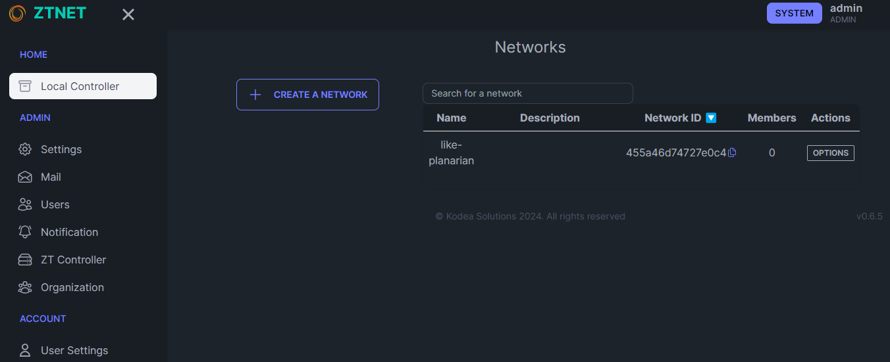

# ZTNET CI/CD pipeline

Deploy ZTNET server with CI/CD on Elestio

 
 

# Once deployed ...

You can open ZTNET ADMIN UI here:

    URL: https://[CI_CD_DOMAIN]
    email: [ADMIN_EMAIL]
    password: [ADMIN_PASSWORD]

You can open pgAdmin here:

    URL: https://[CI_CD_DOMAIN]:33623
    email: [ADMIN_EMAIL]
    password: [ADMIN_PASSWORD]

# ZeroTier Client

If you want to connect to an instance, you need to use a client like ZeroTier. If you do not have it installed, you can download ZeroTier here:
https://www.zerotier.com/download/
